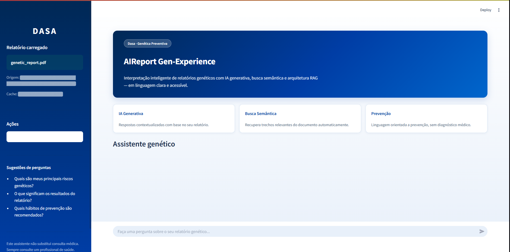
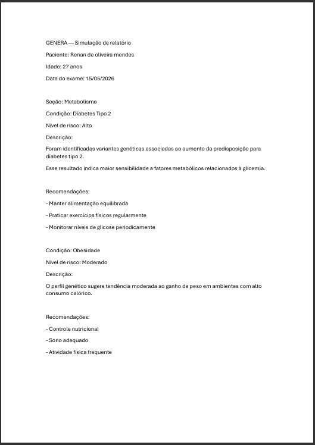
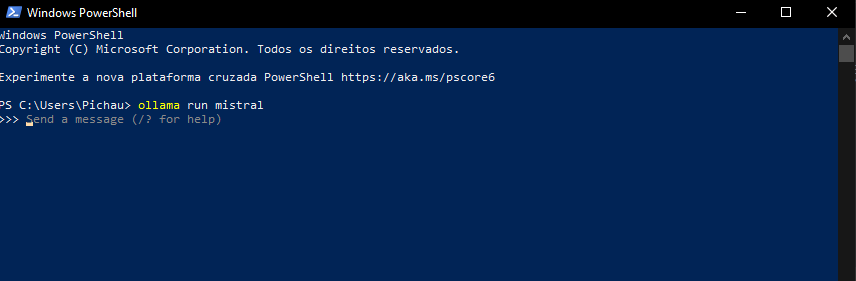
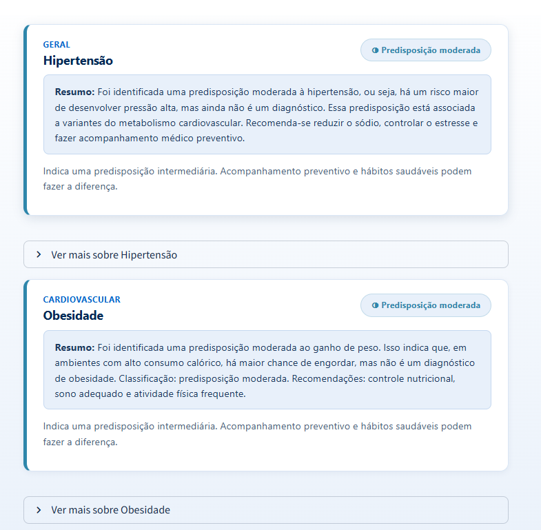
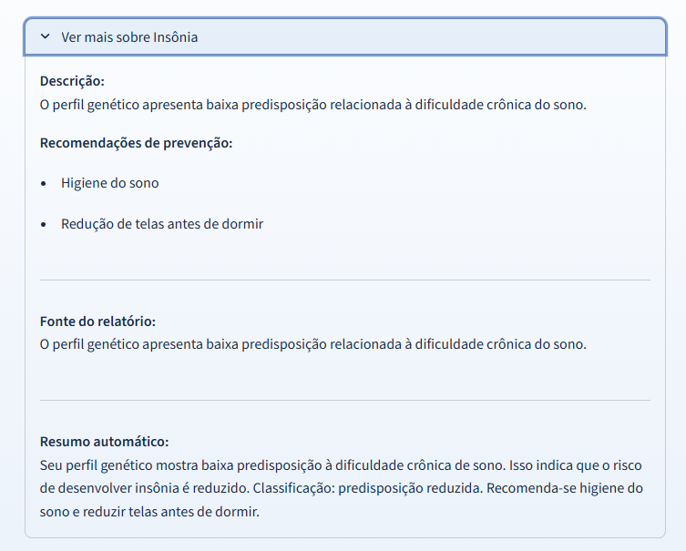
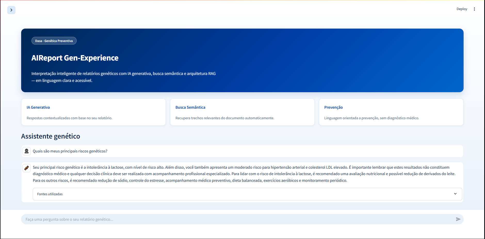
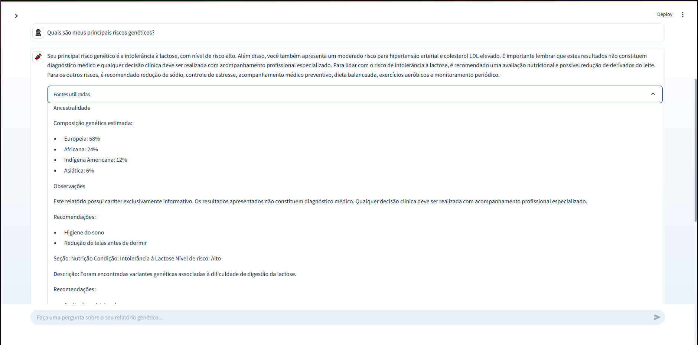
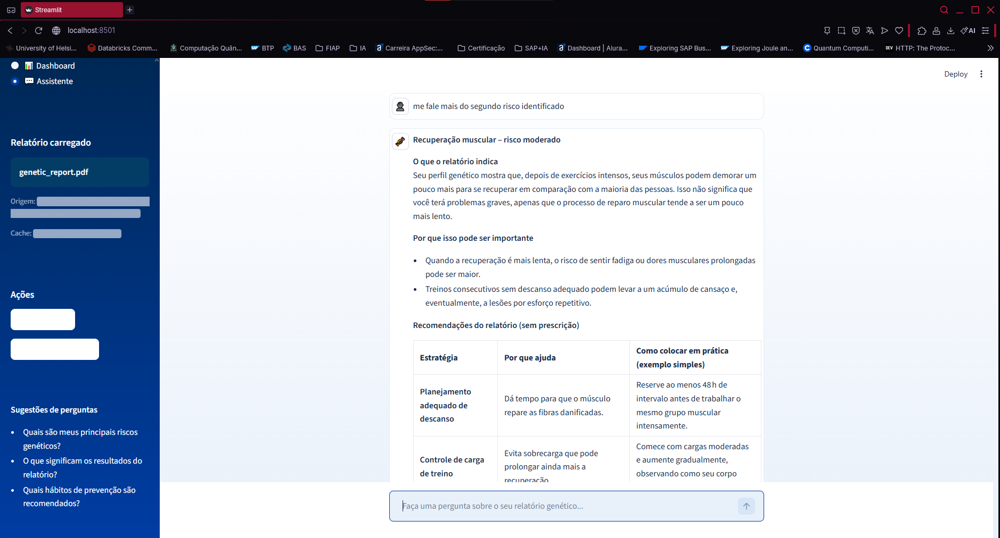
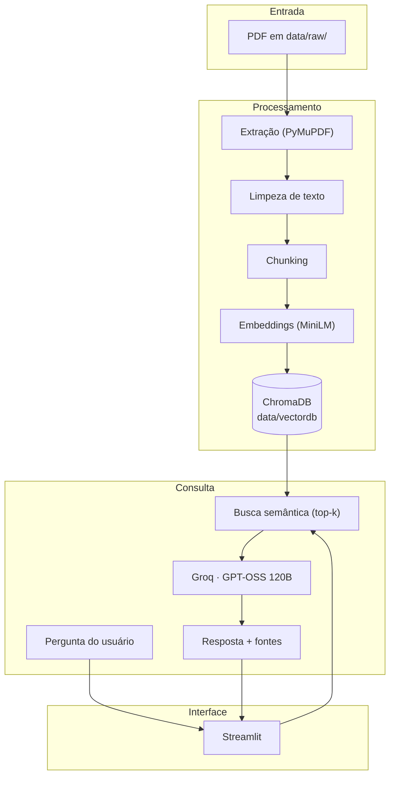

# AIReport Gen-Experience

<p align="center">
  <a href="https://www.fiap.com.br/"></a>
</p>

<p align="center">
  <strong>Enterprise Challenge · Sprint 3 · Dasa / Genera</strong>
</p>

---

# Enterprise Challenge - SPRINT 3 - DASA

Solução de **conversação inteligente de relatórios genéticos da DASA** que transforma PDFs técnicos em uma experiência inteligente, conversacional, clara e visual — utilizando **RAG** (Retrieval-Augmented Generation), busca semântica e IA generativa via **Groq** (GPT-OSS 120B).

### Link do vídeo: https://youtu.be/Bxk57Nue2yY

## Índice

- [Autor](#autor)
- [Sobre o projeto](#sobre-o-projeto)
- [Problema de negócio](#problema-de-negócio)
- [Solução](#Solução)
- [Como funciona](#como-funciona)
- [Arquitetura](#arquitetura)
- [Tecnologias](#tecnologias)
- [Estrutura do repositório](#estrutura-do-repositório)
- [Pré-requisitos](#pré-requisitos)
- [Instalação e execução](#instalação-e-execução)
- [Interface web (Streamlit)](#interface-web-streamlit)
- [Modo terminal (CLI)](#modo-terminal-cli)
- [Governança e Privacidade](#governança-e-privacidade)
- [Próximos Passos](#Próximos-Passos)


---

## Autor

**Enterprise Challenge — Sprint 3 — DASA**

| Nome | RM | 
|------------|-----|
| <a href="https://www.linkedin.com/in/renanmendes26/">Renan de Oliveira Mendes | RM563145</a> |

---

## Sobre o projeto

O **AIReport Gen-Experience** foi criado exclusivamente para o **Enterprise Challenge FIAP × Dasa**, especificamente para o produto da **Genera**: exames genéticos que entregam informações valiosas sobre predisposições, metabolismo, saúde e muito mais.

O desafio central é que os relatórios genéticos costumam ser:

- Extensos e apresentar uma **linguagem técnica**
- Entregues em **PDF estático**, com pouca interatividade
- Difíceis de compreender pelo **cliente** sem apoio profissional

O **AIReport Gen-Experience** permite que o usuário **converse com o próprio relatório**: faça perguntas em linguagem natural e receba respostas baseadas apenas no conteúdo do documento, com tom muito acessível e focado em prevenção.

Para essa terceira fase desenvolvemos uma interface visual limpa que resume o relatório por meio de cards e dashboards, facilitando ainda mais o entendimento do usuário e permitindo uma navegação mais precisa dentro de suas próprias caracteristicas genéticas.

Indo além, mudamos a forma de processamento do LLM antigo, que antes rodava um modelo menor loca. Agora utilizamos uma API e comunicação sincrona com um modelo mais forte, permitindo melhor desempenho, tempo de resposta e mais próximo das melhores práticas de mercado.

Por fim adicionamos um agente personalizado com memória, dessa forma o agente tem capacidade de se lembrar da conversa e conseguir explicar ainda melhor os pontos principais do relatório.



### O que a aplicação faz hoje

| Funcionalidade | Descrição |
|----------------|-----------|
| Leitura automática do PDF | Carrega o relatório de `data/raw/` sem upload manual |
| Extração e limpeza de texto | PyMuPDF + normalização para indexação |
| Base vetorial persistida | ChromaDB com cache — reindexa só se o PDF mudar |
| Dashboard | Página principal com gráficos totalmente customizada de acordo com o relatório do usuário |
| Chat inteligente | Perguntas e respostas com contexto recuperado (RAG) |
| Interface Dasa | Streamlit com identidade visual azul e branco |
| Guardrails de IA | Sem diagnóstico, sem prescrição, linguagem preventiva |

### Relatório Simulado



### Processamento



### Dashboard



### Resumo Dinâmico



### Assistente




### Assistente com Memória



---

## Problema de negócio

Os relatórios do Genera concentram dados sensíveis e relevantes, mas o formato atual gera conflitos:

- **Paciente**: dificuldade de entender riscos e próximos passos
- **Médico**: tempo extra para traduzir o relatório em linguagem acessível
- **Dasa / Genera**: subutilização do valor percebido do exame

O AIReport Gen-Experience aumenta a autonomia, clareza e engajamento, sem substituir o acompanhamento com o médico.

### Personas

| Persona | Necessidade |
|---------|-------------|
| **Paciente** | Entender resultados, riscos e hábitos de prevenção em linguagem simples |
| **Médico** | Apoio rápido na comunicação e exploração do relatório |
| **Dasa** | Diferencial de experiência e maior valor do produto Genera |

---

## Solução

### Oportunidade de Negócio

O mercado de saúde está migrando para:
 - medicina personalizada; 
 - prevenção; 
 - experiência digital; 
 - IA assistiva; 
 - saúde orientada por dados. 

O Genera possui enorme potencial de diferenciação ao transformar:
relatórios estáticos
em:
**experiências conversacionais inteligentes.**


### Valor Gerado para a Dasa

| Área |Valor |
|----------------|-----------|
|Experiência do paciente | maior entendimento |
|Engajamento | aumento do uso do exame |
|Diferenciação competitiva| inovação digital |
|Escalabilidade | redução de suporte interpretativo |
|Fidelização | maior percepção de valor |
|Saúde preventiva	 | incentivo a hábitos saudáveis |
________________________________________
### Valor Gerado para Pacientes

|Benefício	| Impacto |
|----------------|-----------|
|Linguagem simples | acessibilidade |
|Interação conversacional |	autonomia |
|Explicabilidade	 | confiança |
| Respostas contextualizadas | personalização |
| Foco preventivo	| conscientização |
________________________________________

### Diferenciais Técnicos da Solução

| Diferencial | Impacto |
|----------------|-----------|
|RAG | redução de alucinação |
|Groq (GPT-OSS 120B) | respostas rápidas e gratuitas |
|Busca semântica | maior precisão |
|ChromaDB | escalabilidade |
|Engenharia de prompts | controle comportamental |
|Explicabilidade | rastreabilidade |


---

## Como funciona

O fluxo segue uma arquitetura **RAG** em quatro etapas:

1. **Ingestão** — O PDF em `data/raw/genetic_report.pdf` (ou o primeiro `.pdf` da pasta) é lido automaticamente.
2. **Processamento** — Texto extraído (PyMuPDF), limpo e dividido em trechos (*chunks*).
3. **Indexação** — Embeddings (`sentence-transformers/all-MiniLM-L6-v2`) armazenados no ChromaDB em `data/vectordb/`.
4. **Consulta** — A pergunta do usuário recupera os trechos mais relevantes; o modelo **GPT-OSS 120B** (Groq) gera a resposta usando apenas esse contexto.


Na primeira execução, a indexação pode levar alguns minutos. Nas seguintes, o sistema reutiliza o cache vetorial enquanto o arquivo PDF não for alterado.

### Exemplos de perguntas

- *Quais são meus principais riscos genéticos?*
- *O que significa predisposição aumentada para diabetes tipo 2?*
- *Quais hábitos de prevenção são recomendados com base no meu relatório?*

---

## Arquitetura




### Pipeline de dados (PDF → resposta)

```
data/raw/genetic_report.pdf
        ↓
  Extração de texto (parser_pdf)
        ↓
  Limpeza e normalização (text_cleaner)
        ↓
  Divisão em chunks + embeddings (vector_store)
        ↓
  Persistência ChromaDB (cache em data/vectordb)
        ↓
  Pergunta → similarity_search → prompt (prompt_engineering)
        ↓
  LLM Groq (openai/gpt-oss-120b) → resposta contextualizada
```

---

## Tecnologias

| Camada | Tecnologia |
|--------|------------|
| Interface | [Streamlit](https://streamlit.io/) |
| Orquestração IA | [LangChain](https://www.langchain.com/) |
| LLM | [Groq](https://groq.com/) + modelo `openai/gpt-oss-120b` |
| Embeddings | `sentence-transformers/all-MiniLM-L6-v2` |
| Vetorização | [ChromaDB](https://www.trychroma.com/) |
| PDF | [PyMuPDF](https://pymupdf.readthedocs.io/) (`fitz`) |
| Linguagem | Python 3.10+ |

---

## Estrutura do repositório

```
genreport-ai-streamlit/
├── streamlit_app.py          # Aplicação web principal
├── app/
│   ├── config.py             # Caminhos e constantes (Dasa, data/)
│   ├── parser_pdf.py         # Extração de texto do PDF
│   ├── text_cleaner.py       # Normalização do texto
│   ├── embeddings.py         # Modelo de embeddings (cache)
│   ├── vector_store.py       # ChromaDB: criar ou reutilizar índice
│   ├── report_pipeline.py    # Carregamento automático do relatório
│   ├── rag_engine.py         # Busca + geração com Groq
│   ├── prompt_engineering.py # System prompt e guardrails
│   ├── ui.py                 # Estilos e componentes visuais Dasa
│   └── main.py               # Modo CLI (terminal)
├── data/
│   ├── raw/                  # Coloque o PDF do relatório aqui
│   └── vectordb/             # Cache do índice vetorial (gerado)
├── .streamlit/
│   └── config.toml           # Tema azul/branco Dasa
├── requirements.txt
├── assets
├── relatorio_governaca_riscos.pdf
└── README.md

```

---

## Pré-requisitos

1. **Python 3.10** (recomendado — é a versão usada pelo `streamlit` no ambiente típico do projeto)
2. **Chave de API Groq** (gratuita em [console.groq.com](https://console.groq.com/))
3. Configure a chave no arquivo `.env`:

```bash
GROQ_API_KEY=gsk_sua_chave_aqui
GROQ_MODEL=openai/gpt-oss-120b
```

4. Relatório genético em PDF na pasta `data/raw/`

> **Dica:** Use sempre o mesmo interpretador Python para instalar dependências e rodar o app (`py -3.10 -m pip` e `py -3.10 -m streamlit`).

---

## Instalação e execução

### 1. Clone o repositório e entre na pasta

```bash
cd genreport-ai-streamlit
```

### 2. Crie um ambiente virtual (opcional)

```bash
py -3.10 -m venv .venv
.venv\Scripts\activate        # Windows
# source .venv/bin/activate   # Linux/macOS
```

### 3. Instale as dependências

```bash
py -3.10 -m pip install -r requirements.txt
```

### 4. Adicione o relatório PDF

Coloque o arquivo em:

```
data/raw/genetic_report.pdf
```

Ou qualquer outro `.pdf` em `data/raw/` (o sistema usa o primeiro encontrado se `genetic_report.pdf` não existir).

### 5. Configure a chave da Groq

Crie um arquivo `.env` na raiz do projeto com sua chave da API Groq (obtida gratuitamente em [console.groq.com](https://console.groq.com/)):

```bash
GROQ_API_KEY=gsk_sua_chave_aqui
GROQ_MODEL=openai/gpt-oss-120b
```

### 6. Execute a aplicação web

```bash
py -3.10 -m streamlit run streamlit_app.py
```

Acesse o endereço exibido no terminal (geralmente `http://localhost:8501`).

---

## Interface web (Streamlit)

A interface foi pensada para a identidade **Dasa** (azul `#003DA5` e branco):

- **Hero** com descrição do produto e cards informativos
- **Sidebar** com status do relatório carregado, sugestões de perguntas e aviso médico
- **Chat** interativo com histórico e expander de *fontes utilizadas*
- Botão **Reprocessar relatório** para forçar nova indexação após trocar o PDF

Não é necessário fazer upload: o app lê automaticamente o PDF em `data/raw/`.

---

## Modo terminal (CLI)

Para testar o pipeline sem interface gráfica:

```bash
py -3.10 -m app.main
```

O script carrega o PDF, indexa (ou reutiliza o cache) e abre um loop de perguntas. Digite `sair` para encerrar.

---

## Governança e Privacidade

Pensando e aprofundando em questões legais, éticas e de gonvernança de modelos de IA e dados, desenvolvi o relatório anexo "relatorio_governaca_riscos.pdf"

Por onde passo e especifico todos os pontos pensados, aplicados e planejados da solução, voltados a atender esses aspectos essenciais de análise de riscos.

De forma resumida nessa etapa apliquei a seguinte abordagem:

| Aspecto | Abordagem |
|---------|-----------|
| Dados genéticos | Altamente sensíveis — uso apenas local no protótipo |
| Armazenamento | PDF em `data/raw/`; índice em `data/vectordb/` (ambiente local) |
| Guardrails da IA | Sem diagnóstico, sem prescrição, apenas contexto do relatório |
| Responsabilidade | Aviso na interface: não substitui consulta médica |

O *system prompt* em `app/prompt_engineering.py` reforça linguagem simples, tom não alarmista e ênfase em prevenção e acompanhamento profissional.

---

## Próximos Passos

Além do que já foi desenvolvido, atualmente estudo formas de expandir e melhorar a solução.

Considerações e planejamento:

- [ ] Resumo automático dos principais riscos na abertura do app
- [ ] Suporte a múltiplos relatórios / perfis de paciente
- [ ] Dashboards genéticos; 
- [ ] Integração nativa com plataforma Genera;
- [ ] Correlação entre achados genéticos;
- [ ] Memória Conversacional;
- [ ] Sistema de Recomendação Personalizado
- [ ] Deploy em ambiente seguro com HTTPS e políticas de retenção de dados;
- [ ] Priorização de riscos;
- [ ] Avaliação com usuários reais (pacientes e médicos);
- [ ] Métricas de qualidade das respostas (RAG evaluation);
- [ ] Integração opcional com APIs cloud (OpenAI);
- [ ] Arquitetura Empresarial
- [ ] Segurança Avançada

 Dessa forma a solução se torna completa, implementada ao ambiente corporativo, de forma segura e visual.


 O maior diferencial não será apenas:

"conversar com o PDF"

mas sim:

**transformar dados genéticos complexos em inteligência preventiva personalizada.**

---

## User stories atendidas

| ID | História | Status |
|----|----------|--------|
| US1 | Como paciente, quero entender meu exame em linguagem simples | Parcial — via chat contextualizado |
| US2 | Como paciente, quero fazer perguntas sobre meu exame | Implementado |
| US3 | Como paciente, quero visualizar um resumo dos principais riscos | Planejado |

---

## Licença e contexto acadêmico

Projeto desenvolvido para fins educacionais no **Enterprise Challenge FIAP**, em parceria com a **Dasa**. O uso de dados genéticos reais deve seguir políticas de privacidade, LGPD e orientação institucional da Dasa.

---

<p align="center">
  <strong>AIReport Gen-Experience</strong> — Transformando relatórios genéticos em clareza, prevenção e autonomia.
</p>
